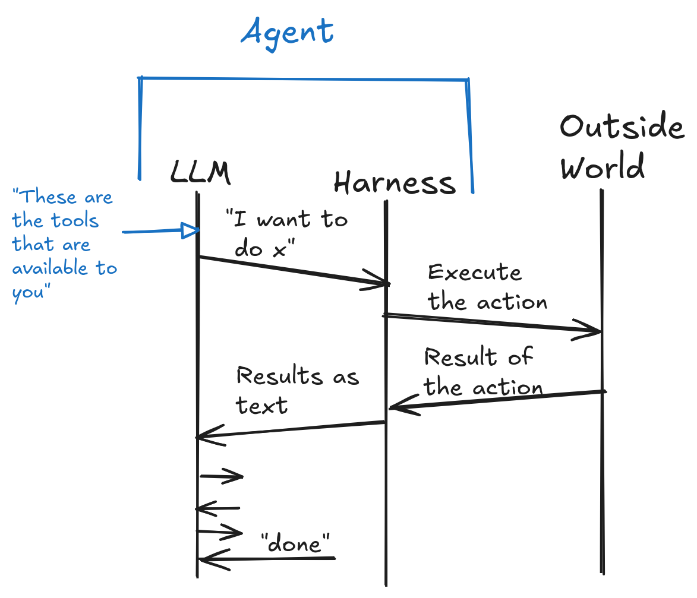

# Multi-Agent Systems

## Lecture 3: Sept 1

### Reinforcement Learning

- We know what the desired outcome is.
- There is no clear path for the desired outcome. We can use
  punishments/rewards for steering the agent towards the desirable outcome.
- The goal of the agent is to maximize the rewards.
- Optimizing for rewards takes place through training.

Different uses:
- Self-piloting vehicles
- fuzzing (test generation)

#### Agent

An agent is a program/machine such that the agent can observe the environment
and possible actions are determined through this observation.

The entity performing actions (a) to move to a new state (s).
Wants to get mac reward(r) (this is immediate feedback from the env for taking this action.)

Learns/has a policy(π)
- Strategy for attaining max r
- Polict determines value $v$: the expected benefit of the action.
- both immediate and long-term

$π: (s, a)$ → expected return

> [!NOTE]
> **On Expected Return:**
> Can think of it as a return on investment

> [!NOTE] 
> **On LLMs:**
> context is the state, actions is predicting next token, the
> new state is context + (previous prediction)

#### Environments

The general outside world.

This is the state space that the agent interacts with.
An agent may interact with real or virtual spaces:
- Autonomous driving
- Robotics
- Games
- Synthesis

An environment could be fully or partially observable.

**Full:** Perfect information: chess, go
**Partial:** Imperfect information: poker

The system itself can be either stochastic or deterministic.

#### Rewards

- Immediate outcome of an action.
- Could be positive or negative
- We define these values based on the outocme.

There are some issues in reward design:
- Can create perverse incentives.
- Sparse rewards are harder to incentivize.
- Artificial rewars can change training outcome. You might want artificial
  rewards when the bulk of rewards come towards the end. this is because it is
  difficult to propagate back the reward through a long sequence.

Example: coding agents

- Goal: write a program that passes all tests.
- Need a very long reward horizon
- State/action space: let's design together
- what are good intermediate rewards?

**Why is this an RL problem?**

- The agent takes actions to reach a final solution.
- The actions change the env and have observable effects.

#### In-class exercise: Designing an agent for Leetcode

1. **What's the problem we are solving?**

Find the fastest program that passes all tests

2. **What is observable?**

- Problem text
- Test cases
- If passing: total runtime
- Languages available to implement the solution
- The starter code
- Counter-example
- previous attempts and their results

3. **What are the potential actions?**

- Edit the code
- Run public tests
- Add new tests
- Submit the code
- pick a language

4.**What is good feedback?**

- It works
    - based on efficiency.
- no. of hidden tests passed.
- compilation errors/crashes

### Tool Use

LLMs can only predict/generate text.

> [!NOTE] 
> **Harness:**
> You can think of the harness as Agent - LLM
