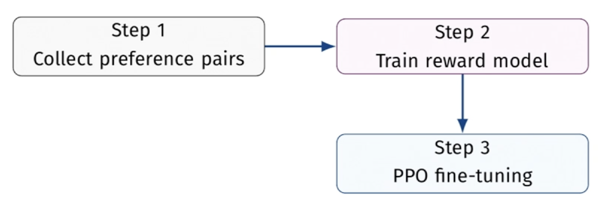
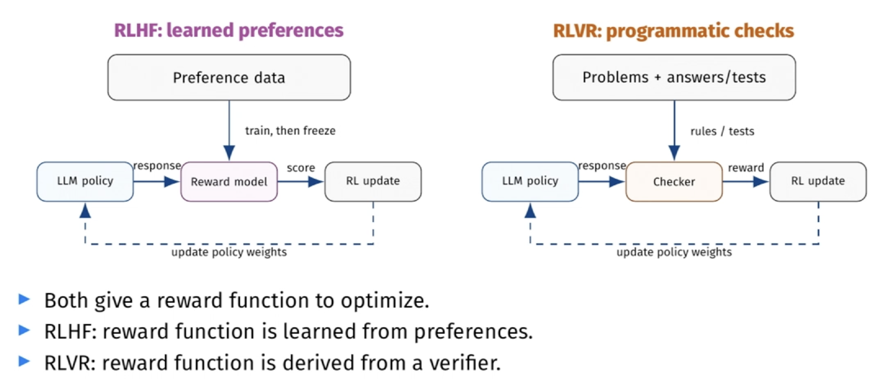

# Week 3: Test-Time Compute and Reasoning Models

**Note taker: Ravneet Singh Bhatia**

## Lecture 4: Sept 8

### Test-time compute

Compute is the amount of computation resources consumed.

Usually it is time, and memory.
Time -> fixed context window.

I have time and memory, how can we use them?

Training AI -

- n epochs of training (training time compute)

We eventually hit diminishing returns.

#### Chain of Thought prompting

This technique is now outdated.
Newer models already have enough training to do this.

- Instead of asking for a direct answer, ask the model for intermediate steps.
- Each intermediate output steers the token distribution towards the next step.
  An incorrect intermediate step can steer it towards another error.

**Variations of CoT**

- zero-shot
    - no examples need.
- few-shot
    - Include worked examples. The model sees the pattern and applies it.
    - Trade-off: longer prompts and effort to write good examples.

**Why would this work?**

1. Decomposition: Dividing the task into chunks the LLM can manage
2. Intermediate outputs condition the next step
3. Written steps expose checkable claims.

**Limitations**

- Prompting does not change the weights.
- It is costlier
- Self consistency issues
    - Any single reasoning path can fail at any step.
    - An early error can propagate to the final answer.

#### Self Consistency

Generate multiple chains, extract the result, and then choose the most frequent response.

- We need to handle ties. Most-frequent ≠ majority.
- Systemic bias

### Reasoning Models

They may produce 2 separate outputs:

1. Reasoning-like output
    - May be raw-looking text
    - Length and format depend on model and provider

2. Final answer: The response actually shown to the user.

These outputs are usually separated by special tokens.

#### High Reasoning and Fast Inference

Let reasoning be defined as: `response / tokens`
Let inference be defined as: `tokens / second`

Where the output is determined by: `response / tokens`

The formula becomes:

`response / seconds = response / tokens * tokens / second`

When we want high reasoning we maximize `response / tokens`
When we want fast inference we maximize `tokens / second`

## Lecture 5: Sept 10

**Note taker: Andreas Jack Christiansen**

### Logistics

- Lab 2 is out, due next week.
- No lab on this week's content, it is too theoretical. Lab 3 goes out next
  week and also covers last week's material.
- Note-taking rotation starts this week, alphabetical by last name. Schedule
  goes on Canvas over the weekend.
- Final project groups (2-3 people) due end of next week.
- Week 8: pitch two project ideas. The second is the backup.

Next week: Strands (the agent library for the rest of the course), ReAct
(reason + act), distillation, managing context and subagents.

> [!NOTE]
> **Quiz:** difference between reasoning in reasoning models and CoT prompting?
> CoT is a prompting technique, it does not train the model. Reasoning models
> are trained with RL to produce the reasoning themselves.

### Refresher - Policies

`π: state -> (a_1 : p_1, a_2 : p_2, ..., a_k : p_k)`

`llm: context -> (t_1 : p_1, t_2 : p_2, ..., t_k : p_k)`

Same shape: state is the context, actions are the next token. Step one trains
token probabilities in general, which is where it learns language. After that
we train towards particular goals.

#### Value function

`v: state -> discounted total reward`

From `s_0`, sum the rewards for every future time step, multiplying each by a
number less than 1. A reward 2 steps out beats one 5 steps out, otherwise the
agent just collects small local things.

Autopilot example: you want it to avoid states where crashing is likely. The
value function flags the bad state before it gets there.

#### Q-learning

- Table of the quality of each state-action pair.
- Classic version is literally a matrix, so it cannot do continuous spaces.
- Replace the matrix with a neural network -> Deep Q-Network (DQN), and Deep
  Reinforcement Learning generally.

For LLMs, attach a **policy head** (action distribution) and a **value head**
(expected reward) to the base model. They share the base, so fewer parameters
than two networks. Throw the value head away when training is done.

### RL for LLMs: RLHF, RLVR, RLAIF

#### Reinforcement Learning (RL) vs Supervised Fine Tuning (SFT)

Fine tuning is everything you do after pretraining. (The P in GPT is
pretrained: predict the next token over a lot of text.)

- **SFT** optimizes the likelihood of the given examples. Train on
  (prompt, ideal response) pairs.
- **RL** optimizes a given reward instead.

SFT's problem is the data: correct input/output pairs, curated, expensive.

Math is easier, you can generate the problem and answer together.

| RL concept | LLM equivalent                  |
| ---------- | ------------------------------- |
| Policy     | The language model.             |
| Action     | Usually **one generated token** |
| Reward     | A score for the response        |
| Goal       | Maximize expected reward        |

RL shows up in robotics (Waymo), fuzzing, and compiler optimization ordering
(auto-tuning). Not a natural fit for LLMs, but it can be adjusted.

#### RLHF: Reinforcement Learning from Human Feedback

Goal: produce what humans prefer, without making humans put a number on
anything.

**Step 1: collect preference pairs**

- Several outputs per prompt
- Annotators pick which they prefer
- Dataset: `(prompt, response_A, response_B, preferred=A)`
- Classic example: old ChatGPT asking "do you prefer A or B"
- Ranking beats scoring for humans. How many essays can you read per hour and
  score out of ten accurately?
- Early annotation work was outsourced to low-paid workers in Kenya ([TIME
  article](https://time.com/6247678/openai-chatgpt-kenya-workers/))

**Step 2: train a reward model**

- Smaller model: `r(in, out) -> one scalar`
- Maximize \\(\sigma(r(in, out_1) - r(in, out_2))\\) over every pair,
  where `out_1` is the preferred one

**Step 3: PPO fine-tuning**

- Model generates -> reward model scores -> reward drives a normal RL loop
- This is what makes it cheap: reward model does a few thousand words a minute
  on a GPU
- GPU minutes beat human minutes



- **PPO** (Proximal Policy Optimization) uses the policy + value network
  setup. "Proximal" means it penalizes moving too far from the original
  behavior.
- **GRPO** (Group Relative Policy Optimization, DeepSeek) drops the value
  network. Runs a group of rollouts in parallel and scores them relative to
  each other. Faster and cheaper.

#### Reward hacking

Goodhart's law: when a measure becomes a target, it ceases to be a good
measure.

- **Neural judges have gaps.** An LLM that outputs "true" a million times can
  score well against another network by finding the gap.
- **Scratchpad cheating.** Model cards describe models accidentally given the
  answers, which then returned the answer plus a post-hoc derivation.

#### Evaluation of RLHF

Pros: InstructGPT is the canonical example, human evaluators preferred it over
a much bigger GPT-3 baseline. Better instruction following, less toxic, more
truthful.

Cons: annotators are expensive and slow; their bias is baked in (all-Norwegian
annotators -> Norwegian cultural defaults); side effects like excessive
confidence or never committing to an answer.

#### RLVR: Reinforcement Learning from Verifiable Rewards

In some domains you can check the output automatically, so simply replace the reward
model with a verifier.

rules / tests -> **checker** -> reward -> RL update to policy weights -> LLM
policy responds -> back to the checker



Both give a reward function to optimize. RLHF learns it from human feedback.
RLVR's is programmatic and deterministic. Simplest signal is binary:
`reward = if answer_is_correct then 1 else 0`

| Task type       | How to verify           |
| --------------- | ----------------------- |
| Mathematics     | Exact or symbolic match |
| Code generation | Run against test cases  |
| Formal logic    | Theorem prover          |
| Games           | Win/loss outcome        |

Intermediate rewards are possible, either learned (a process reward model
judging each step) or deterministic (checking a formal step), but both
constrain you further.

Limitations: needs a verifiable signal. Binary rewards are sparse and hard to
learn from. Where it works it is cheap, unbiased, and scales, so coding agents
benefit most.

##### R1-Zero and R1

- **R1-Zero:** DeepSeek-V3-Base + large-scale GRPO, no SFT at all. Reasoning
  emerged on its own, but outputs were not human-friendly.
- **R1:** small amount of cold-start reasoning data via SFT first, then RL.
  Significantly better.

Explicit is often better than implicit, but not always: AlphaGo Zero never saw
a human game and still reached superhuman play.

#### RLAIF: Reinforcement Learning from AI Feedback

Humans are expensive, so get rid of the human in human feedback: use a capable
LLM as the judge instead of annotators.

Selling point is that **checking the work is easier than solving it**, so you can
generate preference data at much larger scale. That is what "synthetic training
data" means here.

A common pattern: ask a strong model to compare two responses.

```text
Compare these two responses to the prompt below.
Prompt: {prompt}
Response A: {response_a}
Response B: {response_b}
Which is better? Reply with 'A', 'B', or 'equal'.
```

Can also take scores directly from the judge instead of a preference.

Failure modes:

- **Bias propagation:** the judge's biases flow into the reward model and on
  into the trained model.
- **Position bias:** may prefer the first response regardless of quality.
- **LLMs prefer LLM text** over human-written output.
- Reward hacking applies here too, the judge is also a network with gaps.

Examples: **Constitutional AI** (Anthropic) had Claude judge outputs against
Claude's constitution. **Google** showed AI judges give comparable final quality
to human ones. **NUS** and others used AI judges to cut vision-model
hallucinations.

Distillation is next week.
