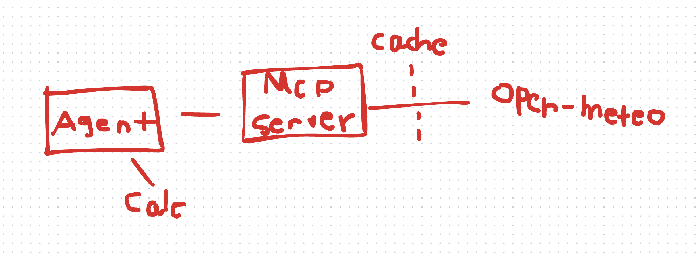
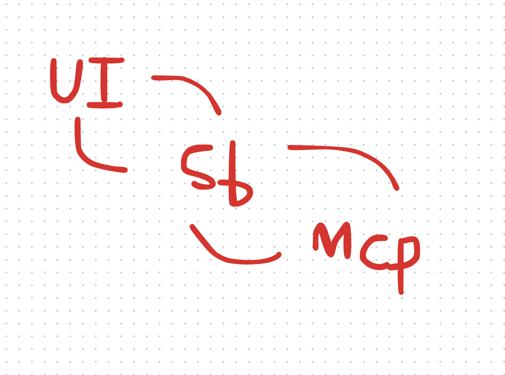
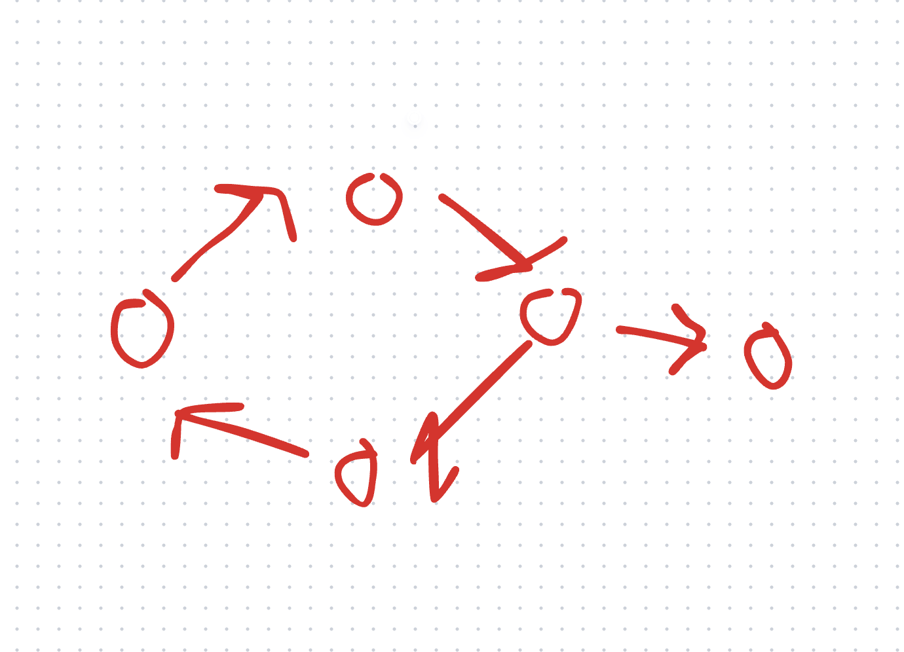
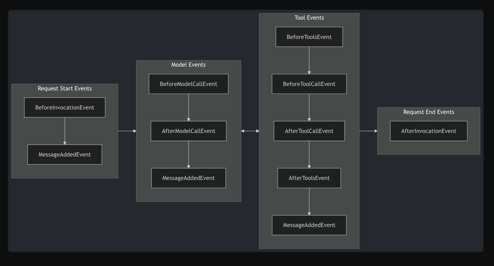

# Week 3: reAct with using SDK Strands 

**Note taker: Srikar Devesetti**

## Lecture 7: Sept 15

# Topics this week

- Strands + MCP
- Strands as a library
- A3 + 4 walkthrough
- Strands exercise
- Ctx management/final project & find teams by Sep 18

**Details of project:** https://www.cs.usfca.edu/~memre/agents/final-project.html

#### Agent & MCP Structure 

- Exercise has an agent connect to a MCP server with a calculator tool

- MCP has tools that will expose to the agent, agent will use the tool to do lookups for data and reasoning

### Next Lab

There will be two separate parts for this task

One lab will consists of two tasks calling the MCP and running the agent

## Use Case of MCP (SVG Tools)

- MCP can be called through HTTP request npx @ model …

> [!TIP]
> **Documentation**:
> For more information, please look at https://github.com/modelcontextprotocol/inspector

- MCP can give tools, prompts and resources and also returns an result address

- MCP can call an SVG that has reasoning and be able to draw figures

- Instead of calling a tool to embed it to an agent, a MCP can get that agent to call that service

- `@server.tool` connect parameters to the server tool function

- When reasoning gets called through API, some methods may be expensive to use

- `IntermediateOutput` has a reason checker measured by verbosity

- `Async` allows a nicer running and handle certain things like access to cli

## Sandboxing

The UI has a sandbox that connects to the MCP, a practical CS practice

## SDK makes software easier

- Strands agent is a SDK
- Comes with small number of tools
- RAGS File operations Shell AWS services

## Different Multi Agent System

- Graph
- Swarm
- Workflow

Pattern example:

## Observability checks for any risks

1. Logs
   - Unused events
2. Traces
   - Rec history
   - Root cause analysis for logs and traces
3. Metrics
   - Alarm
   - Detect when things go wrong

Calling an agent has states, that stores information that can be tracked in other API calls

## Events

Events are signaling points in the agent's execution loop

## Hooks are running in a loop

- Calling different events in a while loop can be complicated
- `before_model_call()` can call hooks in an easier way
