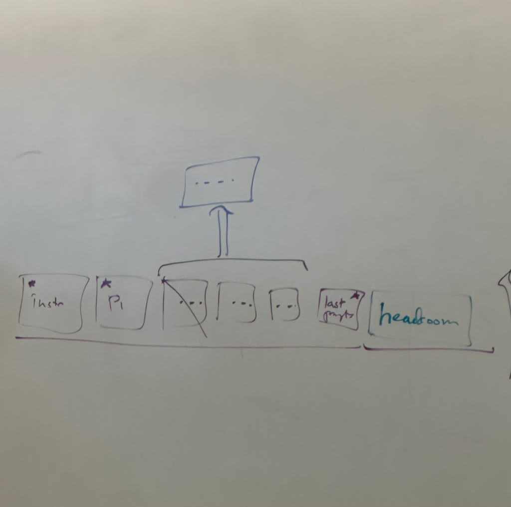

# Week 5: Context Budgeting

**Note taker: Ayeman Fouad**

## Lecture: Sept 22

# Topics this week

- Why agent context grows and one-shot context doesn't
- The three costs of a large context: money, latency, accuracy
- Attention and the "lost in the middle" problem
- Context hygiene
- Managing the window: trimming, summarizing, pinning
- Auto vs. agentic context managers

## Why this only matters for agents

A one-shot LLM task does not have this problem. If I paste a news article and say "summarize this according to these rules," the prompt plus the article is the whole context, the model produces one round of output, and it ends. Nothing accumulates.

An agent is different. The user query goes to the provider, the provider processes it, the model emits a tool call, the result comes back into the context, the model reasons over it, calls another tool, and so on. Reasoning output is also text, and it also goes back into the context. Every loop iteration makes the input bigger.

So the thing I actually need to manage is: **what survives into the next turn?** If some piece of information is not in the prompt I send, it is gone, and the agent cannot act on it.

## The window is fixed, and output has to fit in it

Models are trained with a fixed context window. That budget covers **both** the input and everything the model is about to generate.

Say the window is 4 tokens and I've already filled it with a query `A B C`. The model generates `D` — fine, it fits. Now it needs to generate `E`: while producing `E` it can still attend to everything before it. But once the window is full, generating `F` means something has to fall out of view. The model can't attend past the edge of the window, because it was never trained to — the learned positional encodings simply don't go there.

The part that falls out first is the **beginning**, which is exactly where the system prompt and instructions live. I don't want the model to forget its instructions.

So there are two jobs:

1. **Short term (per query):** before generating, estimate worst-case how many tokens the output will take, and reserve that much. This reserved space is the **headroom**. Never start a generation that can't finish inside the window.
2. **Long term (across the loop):** have a strategy to *shrink* the context I'm carrying, so the agent can keep running indefinitely instead of hitting a wall.

## Why a big context is expensive

### Cost

Each round I re-send the entire conversation so far. The amount I send per call grows **linearly**, but the *total* tokens sent across the run grows **quadratically**.

Tiny example — start at 2 tokens and add 1 token per call:

```
call 1:  2
call 2:  3
...
call 10: 11
-----------
total:   65 tokens sent for 10 calls
```

That's already bad at toy numbers. At real numbers it's the dominant cost of running an agent.

### Latency

The whole forward pass has to complete before the first token comes back. Even when streaming, time-to-first-token grows with context size, so the response "shows up slowly." Caching (next lecture) helps with the repeated *prefix* computation, but it does not remove the per-call latency floor.

### Accuracy

This is the surprising one. **More context makes the model worse, not better.**

The classic result ("lost in the middle," run on GPT-3.5-era models): take a set of documents where exactly one contains the answer, and vary *where in the context* that document sits. Baseline is the model answering with no documents at all. Adding documents beats baseline, as expected — but accuracy swings by **more than 20 percentage points** purely based on position, with the middle being worst.

The cause is training. Models are taught to attend strongly to the very beginning (instructions) and the very recent (the current turn). Anything buried in the middle competes with a lot of surrounding noise.

Related: **needle-in-a-haystack benchmarks** — bury one fact in a huge document and see if the model can retrieve it. Newer models are better at this, but not uniformly, since they aren't all optimized for that specific task.

### Reproducing it

The in-class demo (built with Codex) used filler text of the form "tool number 1 is this, tool number 7 is this…" and then asked for one specific value, deliberately with a small ~4B-parameter model and only 4 trials per sample (a real evaluation would use many more).

Results as the filler grew from ~2.5K to ~120K tokens (window is ~131K, so this nearly fills it):

- Fact at the **beginning** → found reliably, even at large context
- Fact at the **end** → found reliably, even at large context
- Fact in the **middle** at large context → found only **~25%** of the time

## Context hygiene

The goal: keep the context **clean** — mostly or only relevant information — so performance doesn't degrade. This is a *performance* concern, distinct from (though related to) security and policy concerns about what the model can see.

Rules of thumb:

- Keep only the relevant information.
- If something will be needed repeatedly, push it into **long-term memory** that can be fetched on demand, instead of carrying it in the window.
- Drop stale information. How aggressive to be depends on how long-running the agent is.

### Design tools to return less

When I write a tool, I should make it return the **smallest useful amount of information**. A tool that dumps everything floods the context with noise and lowers the odds the model finds what matters.

For example: return the top 5 results and let the agent ask for more, or return a summary plus a second tool to drill down.

There's a tradeoff — making tools narrower means more tool calls, more reasoning rounds, and more total calls. Whether that pays off is an empirical question you settle by testing.

### Example: coding agents

Coding agents mostly rip through a codebase with shell commands. They already do a crude version of this trimming — notice how often they read only the first 100 lines of a file rather than the whole thing.

You can do much better by handing them **semantic** tools instead of raw shell. A **language server** can answer "where is `console` defined?", "find all references to this symbol," "list the symbols in this file" — returning a precise answer instead of a wall of search hits. This is the same capability an IDE uses to show you a warning inline or jump to a definition.

The selling point of **LSP is the same as MCP's**: you don't reimplement the integration for every editor. You write one provider for a language, and VS Code, Emacs, etc. can all use it through the common protocol.

Net effect: finer-grained results → less junk entering the context. An agent that leans entirely on shell commands pulls in far more than it needs.

## Managing the window: trimming, summarizing, pinning

Layout of a running agent's context:

```
[ instructions ][ P1 ][ ... ][ ... ][ ... ][ last parts ][ headroom ]
```

The early parts (system prompt, instructions) and the most recent parts are the ones I want to protect. The middle is what I want to reclaim.



In the diagram, the starred blocks (`instr`, `P1`, `last parts`) are **pinned** — never evicted. The middle blocks either get **dropped** (crossed out) or **collapsed upward into a summary** (the arrow into the box above). The bracket on the right is the **headroom** reserved for the upcoming output.

Two basic mechanisms:

- **Trimming** — just drop the oldest messages. Cheap, no extra model call, but the information is gone permanently.
- **Summarizing** — take a span of messages, generate a short summary, and replace the span with it. Uses far fewer tokens while preserving more of the meaning — but the summary can silently lose detail, since not everything survives compression.

**Pinning** is what keeps the important stuff safe from both: mark the system prompt, the original user query, and the current objective as never-evictable.

### Sliding window + summarization in Strands

The pattern used in the agent:

- Keep the last **N** messages (e.g. 8) verbatim
- **Never** drop the first **K** messages (e.g. 2) — these are pinned
- Summarize everything in between and splice the summary into the message list in place of the originals

Variants tune the same knobs: keep the last 5 messages, summarize when you hit 50% of the window, preserve the first *n* messages, and so on. You write a summarization prompt for the helper/summarizing agent, plug the policy into the agent, and that's the whole integration.

### Auto vs. agentic context managers

| | Who decides | Notes |
|---|---|---|
| **Auto context manager** | The harness | Fires automatically when the threshold is hit. Often uses a smaller/cheaper model for summarization. Sensible default. |
| **Agentic context manager** | The model | Give the agent tools plus its remaining budget, and let it call compaction itself. It can choose what's important — but it has to spend reasoning to do so. |

Auto is the recommended default. The catch with the agentic version is that you're handing the model one more thing to think about, on top of the task.

## Gotchas when compressing

- **Does the critical information survive?** Set up the system so must-keep facts are always preserved. (Some tools handle this by declaring certain instructions as always-surviving-compression.)
- **Don't let code drift out of sync.** If summaries skip over code, the model's mental model of the file can diverge from what's on disk.
- **Keep references to the original source.** If a summary turns out to be missing something, the agent should be able to go re-fetch the full detail rather than hallucinate it.
- **Test and benchmark it.** The only question that matters: *after compression, can the agent still take the next step (or series of steps) correctly?* Evaluate that, don't assume it.

