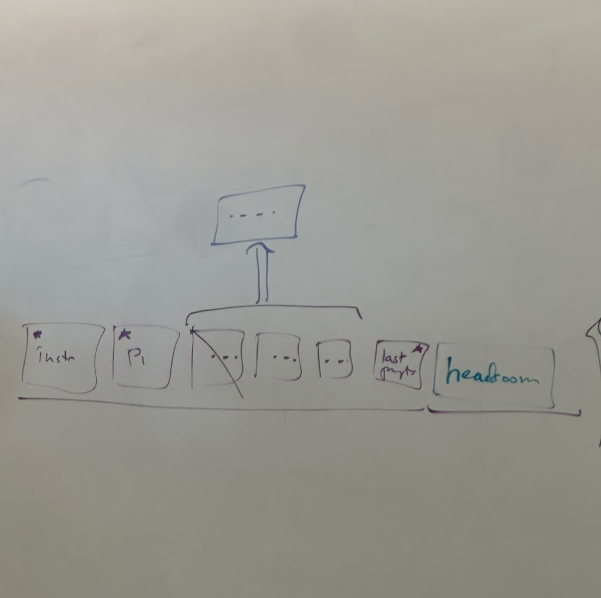

# Week 5: Context Budgeting, Long-term Memory, and Subagents

## Lecture: Sept 22

**Note taker: Ayeman Fouad**

# Topics this week

- Why agent context grows and one-shot context doesn't
- The three costs of a large context: money, latency, accuracy
- Attention and the "lost in the middle" problem
- Context hygiene
- Managing the window: trimming, summarizing, pinning
- Auto vs. agentic context managers

## Why this only matters for agents

A one-shot LLM task does not have this problem. If I paste a news article and say "summarize this according to these rules," the prompt plus the article is the whole context, the model produces one round of output, and it ends. Nothing accumulates.

An agent is different. The user query goes to the provider, the provider processes it, the model emits a tool call, the result comes back into the context, the model reasons over it, calls another tool, and so on. Reasoning output is also text, and it also goes back into the context. Every loop iteration makes the input bigger.

So the thing I actually need to manage is: **what survives into the next turn?** If some piece of information is not in the prompt I send, it is gone, and the agent cannot act on it.

## The window is fixed, and output has to fit in it

Models are trained with a fixed context window. That budget covers **both** the input and everything the model is about to generate.

Say the window is 4 tokens and I've already filled it with a query `A B C`. The model generates `D` — fine, it fits. Now it needs to generate `E`: while producing `E` it can still attend to everything before it. But once the window is full, generating `F` means something has to fall out of view. The model can't attend past the edge of the window, because it was never trained to — the learned positional encodings simply don't go there.

The part that falls out first is the **beginning**, which is exactly where the system prompt and instructions live. I don't want the model to forget its instructions.

So there are two jobs:

1. **Short term (per query):** before generating, estimate worst-case how many tokens the output will take, and reserve that much. This reserved space is the **headroom**. Never start a generation that can't finish inside the window.
2. **Long term (across the loop):** have a strategy to *shrink* the context I'm carrying, so the agent can keep running indefinitely instead of hitting a wall.

## Why a big context is expensive

### Cost

Each round I re-send the entire conversation so far. The amount I send per call grows **linearly**, but the *total* tokens sent across the run grows **quadratically**.

Tiny example — start at 2 tokens and add 1 token per call:

```
call 1:  2
call 2:  3
...
call 10: 11
-----------
total:   65 tokens sent for 10 calls
```

That's already bad at toy numbers. At real numbers it's the dominant cost of running an agent.

### Latency

The whole forward pass has to complete before the first token comes back. Even when streaming, time-to-first-token grows with context size, so the response "shows up slowly." Caching (next lecture) helps with the repeated *prefix* computation, but it does not remove the per-call latency floor.

### Accuracy

This is the surprising one. **More context makes the model worse, not better.**

The classic result ("lost in the middle," run on GPT-3.5-era models): take a set of documents where exactly one contains the answer, and vary *where in the context* that document sits. Baseline is the model answering with no documents at all. Adding documents beats baseline, as expected — but accuracy swings by **more than 20 percentage points** purely based on position, with the middle being worst.

The cause is training. Models are taught to attend strongly to the very beginning (instructions) and the very recent (the current turn). Anything buried in the middle competes with a lot of surrounding noise.

Related: **needle-in-a-haystack benchmarks** — bury one fact in a huge document and see if the model can retrieve it. Newer models are better at this, but not uniformly, since they aren't all optimized for that specific task.

### Reproducing it

The in-class demo (built with Codex) used filler text of the form "tool number 1 is this, tool number 7 is this…" and then asked for one specific value, deliberately with a small ~4B-parameter model and only 4 trials per sample (a real evaluation would use many more).

Results as the filler grew from ~2.5K to ~120K tokens (window is ~131K, so this nearly fills it):

- Fact at the **beginning** → found reliably, even at large context
- Fact at the **end** → found reliably, even at large context
- Fact in the **middle** at large context → found only **~25%** of the time

## Context hygiene

The goal: keep the context **clean** — mostly or only relevant information — so performance doesn't degrade. This is a *performance* concern, distinct from (though related to) security and policy concerns about what the model can see.

Rules of thumb:

- Keep only the relevant information.
- If something will be needed repeatedly, push it into **long-term memory** that can be fetched on demand, instead of carrying it in the window.
- Drop stale information. How aggressive to be depends on how long-running the agent is.

### Design tools to return less

When I write a tool, I should make it return the **smallest useful amount of information**. A tool that dumps everything floods the context with noise and lowers the odds the model finds what matters.

For example: return the top 5 results and let the agent ask for more, or return a summary plus a second tool to drill down.

There's a tradeoff — making tools narrower means more tool calls, more reasoning rounds, and more total calls. Whether that pays off is an empirical question you settle by testing.

### Example: coding agents

Coding agents mostly rip through a codebase with shell commands. They already do a crude version of this trimming — notice how often they read only the first 100 lines of a file rather than the whole thing.

You can do much better by handing them **semantic** tools instead of raw shell. A **language server** can answer "where is `console` defined?", "find all references to this symbol," "list the symbols in this file" — returning a precise answer instead of a wall of search hits. This is the same capability an IDE uses to show you a warning inline or jump to a definition.

The selling point of **LSP is the same as MCP's**: you don't reimplement the integration for every editor. You write one provider for a language, and VS Code, Emacs, etc. can all use it through the common protocol.

Net effect: finer-grained results → less junk entering the context. An agent that leans entirely on shell commands pulls in far more than it needs.

## Managing the window: trimming, summarizing, pinning

Layout of a running agent's context:

```
[ instructions ][ P1 ][ ... ][ ... ][ ... ][ last parts ][ headroom ]
```

The early parts (system prompt, instructions) and the most recent parts are the ones I want to protect. The middle is what I want to reclaim.



In the diagram, the starred blocks (`instr`, `P1`, `last parts`) are **pinned** — never evicted. The middle blocks either get **dropped** (crossed out) or **collapsed upward into a summary** (the arrow into the box above). The bracket on the right is the **headroom** reserved for the upcoming output.

Two basic mechanisms:

- **Trimming** — just drop the oldest messages. Cheap, no extra model call, but the information is gone permanently.
- **Summarizing** — take a span of messages, generate a short summary, and replace the span with it. Uses far fewer tokens while preserving more of the meaning — but the summary can silently lose detail, since not everything survives compression.

**Pinning** is what keeps the important stuff safe from both: mark the system prompt, the original user query, and the current objective as never-evictable.

### Sliding window + summarization in Strands

The pattern used in the agent:

- Keep the last **N** messages (e.g. 8) verbatim
- **Never** drop the first **K** messages (e.g. 2) — these are pinned
- Summarize everything in between and splice the summary into the message list in place of the originals

Variants tune the same knobs: keep the last 5 messages, summarize when you hit 50% of the window, preserve the first *n* messages, and so on. You write a summarization prompt for the helper/summarizing agent, plug the policy into the agent, and that's the whole integration.

### Auto vs. agentic context managers

| | Who decides | Notes |
|---|---|---|
| **Auto context manager** | The harness | Fires automatically when the threshold is hit. Often uses a smaller/cheaper model for summarization. Sensible default. |
| **Agentic context manager** | The model | Give the agent tools plus its remaining budget, and let it call compaction itself. It can choose what's important — but it has to spend reasoning to do so. |

Auto is the recommended default. The catch with the agentic version is that you're handing the model one more thing to think about, on top of the task.

## Gotchas when compressing

- **Does the critical information survive?** Set up the system so must-keep facts are always preserved. (Some tools handle this by declaring certain instructions as always-surviving-compression.)
- **Don't let code drift out of sync.** If summaries skip over code, the model's mental model of the file can diverge from what's on disk.
- **Keep references to the original source.** If a summary turns out to be missing something, the agent should be able to go re-fetch the full detail rather than hallucinate it.
- **Test and benchmark it.** The only question that matters: *after compression, can the agent still take the next step (or series of steps) correctly?* Evaluate that, don't assume it.


## Lecture: Sept 24

**Note taker: Jonathan Samuel Jayaseelan**

### Topics

- Long-term memory: extract and recall, agentic retrieval, maximal marginal relevance
- Kinds of memory and where to store them
- Demo: Mnemosyne, a tutor with memory, sessions, and a reader subagent
- Subagents and Strands' `use_agent`
- Coordination patterns: routing, parallel workers, pipelines
- Evaluating a multi-agent system

Slides: [Memory demo](https://www.cs.usfca.edu/~memre/agents/slides/06.1-memory-demo.pdf), [Subagents](https://www.cs.usfca.edu/~memre/agents/slides/07-subagents.pdf)

### Long-term memory

An agent forgets everything when it shuts down. Long-term memory keeps facts about a task or user across runs.

| | Short-term memory | Long-term memory |
|---|---|---|
| What it is | The context window | A store outside the model (files, a database) |
| What's in it | Queries, responses, tool calls, tool results | Facts and preferences worth keeping |
| Lifetime | One session | Across sessions |

Two operations connect them:

<pre class="mermaid">
flowchart LR
    STM["Short-term memory (context)"] -- extract --> LTM[("Long-term memory")]
    LTM -- "recall relevant info" --> STM
</pre>

Recall is RAG. The difference is the source: RAG indexes a corpus built ahead of time (a codebase, financial records), while memory is built from past conversations. So memory also needs an extract step. Coding agents already do this with memory files: tell it "run these benchmarks whenever you optimize," and it saves that and reads it back the next time it optimizes in that project.

#### Agentic retrieval

Classic RAG retrieves once, up front, using the user's prompt as the query. An agent instead gets retrieval as a **tool** (like the weather tool from the assignment), so it can query mid-task whenever it decides it needs something. For memory, it can also get an `add_memory` tool.

<pre class="mermaid">
flowchart LR
    subgraph Classic RAG
        Q1["User prompt"] --> DB1[("Database")]
        DB1 -- "relevant results" --> M1["Model"]
        Q1 --> M1
    end
    subgraph Agentic retrieval
        Q2["User prompt"] --> A2["Agent"]
        A2 -- "search tool call<br/>(any time, any query)" --> DB2[("Database")]
        DB2 -- results --> A2
        A2 -. "add_memory (optional)" .-> DB2
    end
</pre>

The backing store can be anything: a vector database, a customer DB, Elasticsearch, a keyword index, or an LSP server.

#### Maximal marginal relevance

Top results often overlap. Searching a codebase for `create_window` might return `window.h` (relevance 0.40), `window.c` (0.20), and another file (0.15). The header and implementation say mostly the same thing, so including both wastes tokens.

MMR picks documents by *marginal* relevance:

1. Pick the most relevant document.
2. Re-score the rest by relevance to the query minus similarity to what's already picked.
3. Pick the best, repeat.

Similarity is the cosine similarity (dot product of normalized embeddings) from whatever embedding model the vector DB uses. If `window.h` and `window.c` have similarity 0.8 and the cutoff is 0.7, `window.c` is skipped and the next file takes its slot. The result is a small, diverse set.

#### What to remember

| Kind | Holds | Example |
|---|---|---|
| Episodic | Experience: what worked | "This workflow went well on this kind of task" |
| Semantic | Facts | "This only works on x86." "Code here is styled this way." |
| Procedural | Standing directives | "Whenever you do rendering optimizations, run these benchmarks." |

Users don't have to phrase these as commands. Saying "I prefer raw strings over ugly line continuations" while reviewing code was enough for the coding agent to save it. Agents do *not* reliably save lessons from their own struggles; that's an open problem that products like mem0 and Supermemory target.

#### Writing and storing memories

| | Listener LLM | `add_memory` tool |
|---|---|---|
| Who decides to save | A second, smaller model reading the conversation after each turn | The main agent |
| How you steer it | The listener's prompt | The tool description |

| Storage | Retrieval | Notes |
|---|---|---|
| Text / JSON files | You write it (often keyword matching) | Strands' default file store |
| SQLite / relational DB | SQL | Easy to inspect |
| Vector database | Built-in similarity search | Used in the demo |
| Hosted service | Handled for you | mem0, Supermemory, AWS Bedrock |

### Demo: Mnemosyne, a tutor that remembers

A tutor that remembers a student's learning preferences. Tools: Wikipedia search/fetch and symbolic math.

```python
Agent(
    model=create_model(api_key, TUTOR_MODEL),
    system_prompt=SYSTEM_PROMPT,
    tools=[search_wikipedia,
           wikipedia_fetch_tool(small_model, events),
           symbolic_math],
    memory_manager=memory,             # build/retrieve memories
    session_manager=session_manager,   # restore sessions
    hooks=[events],
    callback_handler=None,
)
```

A large model runs the tutor. A small model extracts memories and summarizes Wikipedia articles to keep the main context clean.

#### Memory modes

| Setting | `--mode auto` | `--mode tool` |
|---|---|---|
| Who decides to write | Extractor after each turn | Tutor calls `add_memory` |
| Automatic extraction | On | Off |
| `add_memory` tool | Off | On |
| Automatic retrieval | Up to 5 entries | Up to 5 entries |
| `search_memory` tool | On | On |

```python
# --mode auto: small model extracts after every turn
extraction = ExtractionConfig(
    trigger=InvocationTrigger(),                         # run after each user query
    extractor=ObservedExtractor(extraction_model, events),  # ModelExtractor + console logging
)
store = TutorMemoryStore(db, events, extraction=extraction)
allow_memory_tool = False

# --mode tool: the tutor decides
store = TutorMemoryStore(db, events)
allow_memory_tool = True
```

Retrieved memories are formatted as pseudo-XML and prepended to the user's query by a hook.

#### Custom memory store

`TutorMemoryStore` implements Strands' `MemoryStore` interface:

```python
async def search(self, query, options=None): ...
async def add(self, content, metadata=None): ...
```

- **LanceDB** stores rows of (timestamp, id, content, embedding) and does cosine-similarity search.
- **Sentence Transformers** computes embeddings on the CPU.
- `add` embeds and inserts; `search` embeds the query and returns the top matches.

About 100 lines total, and it runs offline. In production you'd use Bedrock, Supermemory, or Postgres with a vector extension.

#### Sessions

| | Memory | Sessions |
|---|---|---|
| Saves | Extracted facts | The whole conversation |
| Used for | Recall across sessions | Resuming one conversation |
| In the demo | `TutorMemoryStore` | `SnapshotSessionManager` |

```python
from strands.session import SnapshotSessionManager
from strands.storage import LocalFileStorage

SnapshotSessionManager(
    session_id=session,
    storage=LocalFileStorage(str(sessions_dir / mode)),
)
```

The library saves the conversation after each round.

#### Subagent inside a tool: `fetch_wikipedia`

The fetch tool sends the question and up to 24,000 characters of the article to a throwaway reader agent, and returns only its findings:

```python
reader = Agent(model=model, system_prompt=ARTICLE_PROMPT,
               callback_handler=None)
result = await reader.invoke_async(article_question)
```

<pre class="mermaid">
sequenceDiagram
    participant T as Tutor
    participant F as fetch_wikipedia tool
    participant W as Wikipedia API
    participant R as Reader subagent (small model)
    T->>F: fetch_wikipedia(title, question)
    F->>W: download article
    W-->>F: full article text
    F->>R: question + up to 24,000 chars
    R-->>F: relevant findings
    Note over R: reader is discarded
    F-->>T: findings only (short)
</pre>

#### What happened in the demo

| Step | Result |
|---|---|
| Session 1, auto mode | No memories yet. Asked about natural logarithms; tutor used the reader subagent and symbolic math. |
| After that turn | Extractor saved one preference: the user likes characters and stories (from "I have a hard time remembering things"). Tutor started bringing up Napier, Briggs, Mercator, Euler. |
| Session 2, fresh | "Who invented algebra?" The preference was recalled and the answer was told as a story. |
| Quiet turns | Nothing worth remembering, nothing saved. |
| Resume | `/memories` printed the store. Reconnecting to session 1 restored the full conversation. |

### Subagents

Two goals from the last two lectures: keep each agent **focused**, and keep irrelevant information **out of the context** (the "lost in the middle" curve). A subagent does both. It works on one task in a fresh context and returns only what matters. General idea: **agents as (part of) tools**.

#### Coding-agent example

<pre class="mermaid">
flowchart LR
    C["Coordinator"] -- "1. Tasks" --> R["Code / test research<br/>(fresh contexts)"]
    R -- "2. Summaries" --> C
    C -- "3. Summaries" --> I["Implementing agent<br/>(fresh context)"]
    I -- "4. Patch" --> C
</pre>

The coordinator keeps the goal and combines results. Workers investigate in their own contexts, and their detailed histories stay with them. Aider tried per-role modes (architect, ask, code) early on, before models had enough RL training for it to work well.

#### Make the task and return value concrete

| Send | Return |
|---|---|
| Question: can the student take CS 486? | Eligible: yes or no |
| Completed courses and current catalog | Prerequisites satisfied or missing |
| Constraint: check prerequisites only | Catalog references for each claim |

The coordinator needs the conclusion and evidence, not the search history.

#### Context and tools are separate choices

| Choice | Controls |
|---|---|
| Context | What the worker *knows* |
| Tools | What the worker can *do* |

A fresh context does not sandbox filesystem or network access. Giving each worker only relevant tools also helps because tool-trained models tend to call tools (web search, calculator) even when they don't need to.

#### Strands `use_agent`

- Starts a new agent **without** the parent's conversation history.
- Uses the parent's model by default.
- Omit `tools` → inherits all parent tools; `tools=[]` → no tools.
- Returns response text, model info, and metrics.

```python
from strands import Agent
from strands_tools import use_agent

coordinator = Agent(model=model, tools=[use_agent])

# note that the tool can create an agent with an arbitrary prompt!
result = coordinator.tool.use_agent(
    prompt="Given these prerequisites and completed courses: ...",
    system_prompt=(
        "Check prerequisite eligibility. Return the decision, "
        "missing courses, and supporting catalog references."
    ),
    tools=[],
)
```

#### Who controls the next step?

| Who | How | Trade-off |
|---|---|---|
| Coordinator agent | Calls subagent tools as it sees fit (harness can limit `use_agent`) | Flexible; every decision is an LLM call |
| Harness (your code) | Fixed dependencies, pipelines, graphs | Cheaper and predictable; needs the flow known ahead of time |

If the flow can be fixed ahead of time, fix it. Skipping an LLM call is usually cheaper, and each step can use a smaller model.

### Coordination patterns

| Pattern | Use when | Example |
|---|---|---|
| Routing | Inputs fall into categories needing different prompts/tools | Support tickets |
| Parallel workers | Work splits into independent pieces | Processing many documents |
| Pipeline | Each step needs the previous output | Resume screening |

<pre class="mermaid">
flowchart LR
    router -- billing --> billing
    router -- tech --> tech
    router -- other --> generalist
</pre>

Routing: give each specialist a focused prompt and its tools. Send uncertain cases to a generalist or ask for clarification.

<pre class="mermaid">
flowchart LR
    supervisor --> A["worker A"] --> aggregator
    supervisor --> B["worker B"] --> aggregator
    supervisor --> C["worker C"] --> aggregator
</pre>

Parallel workers cut latency. Workers can share state through a common memory (swarms), which helps discovery-style tasks.

<pre class="mermaid">
flowchart LR
    P["parse resume"] --> G["visit GitHub"] --> S["score resume"]
</pre>

Pipelines fix the order. The GitHub step summarizes a candidate's repos so that detail never enters the main context. (Real LLM-based resume screeners are noisy: one open-source one varied about 15/100 across runs on the same resume.)

### Is the multi-agent system worth it?

If one capable model gets the same result for the same cost, the complex system just adds maintenance. Measure both on the same tasks:

| Measure | Include |
|---|---|
| Accuracy | Final answer checked against task requirements |
| Tokens and cost | All coordinator and worker calls (summaries become the next agent's input) |
| Latency | Time to complete answer (parallelism can lower it) |
| Failure analysis | Wrong routing, missing evidence, conflicting results, facts lost in compression |

Attributing failures in a non-deterministic multi-agent system is hard. More in the evaluation lecture (week 7).

### Next week

- A **graph** makes worker dependencies explicit and names their results.
- A **gate** checks a proposed action in code before it runs, e.g. tests must pass before code review.
- **Workflows** prescribe pipelines.
- **Swarms** pass control dynamically between agents.
